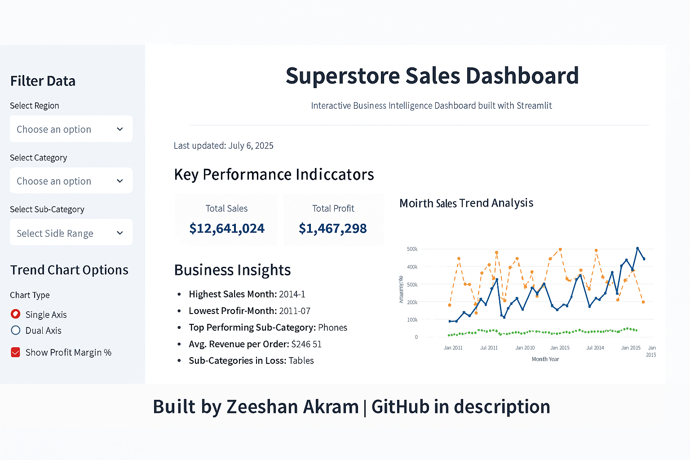
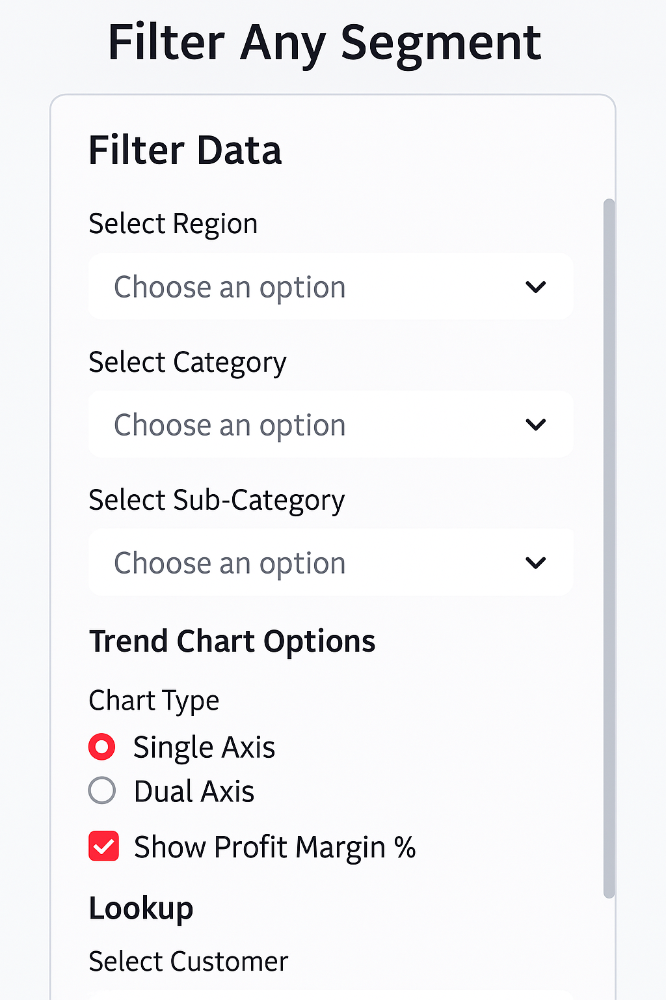
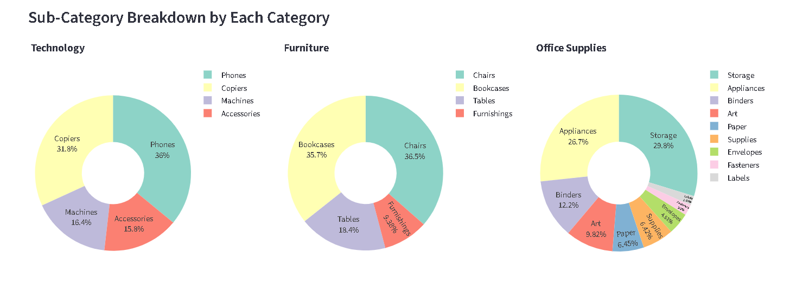
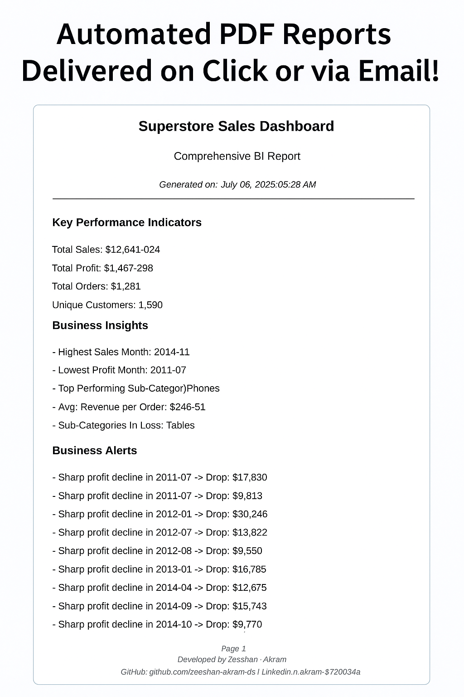

# Superstore Sales Dashboard

## Business Context & Overview

In any growing retail business, understanding performance across regions, customer segments, and product categories is crucial for making data-driven decisions. Executives and managers require real-time insights that go beyond traditional Excel reports — insights that answer *"Where are we making profit? Which customers drive revenue? Where are we losing money?"*.

This interactive dashboard serves as a powerful tool for business stakeholders to monitor operational performance, identify key revenue drivers, detect anomalies, and make actionable decisions — all in one place.

## Problem Statement

Retail businesses, especially those with global operations, struggle to:

* Monitor sales and profit trends across regions and segments
* Identify top-performing customers and products
* Understand segment-wise performance
* Detect underperformance or loss-making areas proactively
* Deliver consistent, shareable, and automated executive reports

Traditional BI tools like Excel are static, slow, and require manual effort to filter and analyze key insights. Stakeholders need something smarter, faster, and interactive.

## Objective

This dashboard is designed to:

* Provide a centralized view of all key performance metrics
* Enable on-the-fly filtering by Region, Category, Sub-Category, and Date
* Highlight actionable insights and business alerts automatically
* Offer customer-level drill-down analysis
* Deliver high-quality, downloadable PDF and CSV reports
* Allow email distribution of PDF reports in seconds

The goal is to replicate real-world BI capabilities in a lightweight, deployable format using Python and Streamlit, while keeping it intuitive for decision-makers.

---

## Dataset Description & Source

* **Dataset**: [Global Superstore sales dataset](https://www.kaggle.com/datasets/apoorvaappz/global-super-store-dataset)
* **Source**: Provided by Developers Hub Internship Task
* **Records**: Over 50,000 sales transactions across multiple countries
* **Fields**: Region, Category, Sub-Category, Customer, Sales, Profit, Discount, Quantity, Segment, City, Date, etc.

## Data Cleaning & Feature Engineering

Performed in a separate Jupyter Notebook to keep `app.py` clean and performant.

### Summary of Cleaning Steps Performed

* Loaded dataset using appropriate encoding (`ISO-8859-1`)
* Dropped irrelevant columns
* Removed duplicates
* Handled missing values smartly
* Parsed 'Order Date' into datetime format
* Converted main columns (`Sales`, `Profit`, etc.) to `float`/`int`
* Extracted new time-based features (`Month`, `Year`, `Weekday`)
* Created additional features:

  * `Sales_per_Quantity`
  * `Profit_per_Sale`
  * `Is_Profitable`
* Verified final shape and saved as a clean CSV for dashboard use

This step ensures the dataset is optimized and ready for interactive BI dashboard development in Streamlit.

---

# Dashboard Features & Business Use Cases

## 1. Executive KPIs

* **Metrics**: Total Sales, Total Profit, Total Orders, Unique Customers
* **Business Value**: Offers a high-level summary of business health at a glance

## 2. Business Insights

* **Auto-generated narrative insights** for stakeholders
* **Business Value**: Saves executive time by automatically surfacing key patterns

## 3. Business Alerts

* Flags:

  * Loss months
  * Profit drops
  * Sales outliers (via IQR method)
* **Business Value**: Enables proactive decision-making without needing manual monitoring

## 4. Best Performing Segment

* Displays the top customer segment based on profit and sales
* **Business Value**: Informs marketing or resource allocation priorities

## 5. Top 5 Customers by Sales (Bar Chart)

* Visualizes most valuable customers
* **Business Value**: Focus retention efforts on key revenue drivers

## 6. Segment-Level KPIs

* Side-by-side view of sales and profit for Consumer, Corporate, and Home Office
* **Business Value**: Tailor strategy based on segment performance

## 7. Sales Trend Analysis

* Line chart with:

  * **Single/Dual Axis toggle** (Sales + Profit)
  * **Profit Margin % toggle**
* **Business Value**: Analyze trends over time and understand profitability dynamics

## 8. Segment-Wise Profit & Sales Breakdown

* Grouped bar chart comparing segments
* **Business Value**: Quickly compare how different customer types contribute to profit

## 9. Sales Share Breakdown (Pie Charts)

* View breakdown by:

  * Category (1 Pie Chart)
  * Sub-Category (3 Pie Charts dynamically by main category)
* **Business Value**: Identify product/service categories that dominate sales

## 10. Filters for Custom Analysis

* Region, Category, Sub-Category, Date Range, Trend Chart Type, Margin Toggle
* **Business Value**: Enables stakeholders to create their own views without any code or Excel

## 11. Customer & Product Lookup Tool

* Drill-down into any customer, view their transaction KPIs, and filter by product
* Download matching records as CSV
* **Business Value**: Supports account-level sales insights and ad-hoc queries

## 12. Full CSV Export

* Download filtered data based on user-defined criteria
* **Business Value**: Seamless export of data for reporting or external analysis

## 13. Generate PDF Report

* Generates executive-ready PDF reports containing:

  * KPIs
  * Business Insights
  * Alerts
* **Business Value**: Enables offline sharing and printing without needing Excel or dashboards

## 14. Email Report (Bonus)

* User can enter email and instantly receive the PDF report via SMTP
* **Business Value**: Facilitates automated report distribution across teams


**Live App**: [Superstore BI Dashboard](https://internship-tasks-devapp-qbezt4qddwcbj4y5qwewjs.streamlit.app/)

---

### Sample Dashboard View



### Filters Panel



### Pie Chart Example



### PDF report sample image



---
### Auto-Generated PDF Report (Sample)

This dashboard includes a powerful feature to generate **clean, professional PDF reports** tailored to selected filters (e.g., region, category, date range). These reports are ideal for stakeholders, team reviews, or record-keeping — and can also be **emailed directly from the app**.

📥 **[Click here to view the sample PDF report](./images/superstore_report.pdf)**  
*Includes KPIs, business insights, performance alerts, and custom formatting.*

---

### Interactive Dashboard Demo (60 seconds)

Watch a live walkthrough of the dashboard in action — including real-time filtering, KPI updates, dynamic visualizations, and automated reporting features.

[](https://www.youtube.com/watch?v=vv4wd2z3mxg) 


> ** Key Highlights Covered in the Demo:**  
> - Dashboard layout & navigation  
> - Filters: Region, Category, Sub-Category, Date Range  
> - Customer & Product lookup  
> - PDF & CSV export functionality  
> - KPI breakdowns & insights panel
---
# Technical Stack

* **Frontend/UI**: Streamlit
* **Backend**: Python (Pandas, Plotly, FPDF, smtplib)
* **Data Source**: Cleaned Global Superstore Dataset (CSV)
* **Deployment**: Streamlit Cloud

---

# How to Run Locally

```bash
# Clone the repository
https://github.com/zeeshan-akram-ds/internship-tasks-devhub

# Navigate to the correct folder
cd Batch2/Task5

# Install requirements
pip install -r requirements.txt

# Run the app
streamlit run app.py
```

---

# Live Demo

[](https://internship-tasks-devapp-qbezt4qddwcbj4y5qwewjs.streamlit.app/)

---

# Author

**Zeeshan Akram**
Data Science and Analytics Intern @ Developers Hub
🔗 [GitHub](https://github.com/zeeshan-akram-ds) | [LinkedIn](https://www.linkedin.com/in/zeeshan-akram-572bbb34a/)

---

Feel free to fork, deploy, or use for your own BI dashboards!

